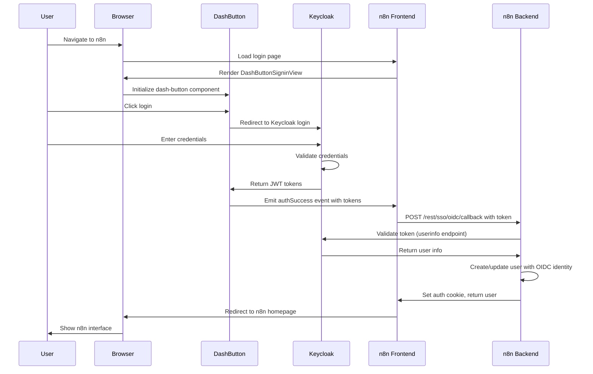

# Dash Button Keycloak Integration for n8n

This document provides a comprehensive guide for integrating the dash-button web component with n8n for Keycloak authentication.

## Overview

The dash-button is a Stencil.js web component that provides Keycloak authentication with SSO capabilities. This integration replaces n8n's default login page with the dash-button component, allowing users to authenticate via Keycloak.

## Architecture

### Frontend Changes
- **New Login Component**: `DashButtonSigninView.vue` - Vue component that wraps the dash-button web component
- **Router Update**: Modified to use `DashButtonSigninView` instead of `SigninView`
- **Vite Configuration**: Updated to recognize `dash-button` as a custom element
- **Dependencies**: Added `dash-button-web@0.0.18` package
- **Font Awesome**: Added to support dash-button icons

### Backend Changes
- **OIDC Controller**: Added `tokenValidationHandler` POST endpoint at `/rest/sso/oidc/callback`
- **OIDC Service**: Added `loginUserWithToken` method to validate JWT tokens from the frontend
- **User Provisioning**: Automatic user creation with OIDC identity linkage

## Prerequisites

1. **Docker** - For running Keycloak
2. **Node.js** and **pnpm** - For building n8n
3. **Keycloak Instance** - See setup instructions below

## Quick Start

### 1. Start Keycloak

```bash
# From the n8n repository root
docker compose -f docker-compose.keycloak.yml up -d

# Wait for Keycloak to be ready (1-2 minutes)
docker logs -f n8n-keycloak

# You should see: "Keycloak ... started in ...ms. Listening on: http://0.0.0.0:8080"
```

### 2. Configure Keycloak

Follow the detailed guide in `keycloak-setup-guide.md` to:
- Create the `n8n-realm` realm
- Create the `n8n-client` client (public, no client secret)
- Create realm roles (`n8n-user`, `n8n-admin`, `n8n-editor`)
- Create test users with credentials

**Important Client Settings:**
- Client authentication: **OFF** (dash-button requires a public client)
- Valid redirect URIs: `http://localhost:5678/*`
- Web origins: `http://localhost:5678`

### 3. Configure n8n

Create a `.env` file in the n8n repository root:

```bash
# Copy the example file
cp .env.keycloak.example .env

# Edit the file to match your Keycloak configuration
```

**Key Configuration:**
```bash
# Backend OIDC
N8N_SSO_OIDC_LOGIN_ENABLED=true
N8N_SSO_OIDC_CLIENT_ID=n8n-client
N8N_SSO_OIDC_CLIENT_SECRET=
N8N_SSO_OIDC_DISCOVERY_ENDPOINT=http://localhost:8080/realms/n8n-realm/.well-known/openid-configuration
N8N_SSO_JUST_IN_TIME_PROVISIONING=true

# Frontend (dash-button)
VITE_KEYCLOAK_URI=http://localhost:8080
VITE_KEYCLOAK_REALM=n8n-realm
VITE_KEYCLOAK_CLIENT_ID=n8n-client
```

### 4. Install Dependencies and Build

```bash
# Install dependencies (including dash-button-web)
pnpm install

# Build the frontend
cd packages/frontend/editor-ui
pnpm build > build.log 2>&1

# Check for errors
tail -n 20 build.log

# Build the backend
cd ../../cli
pnpm build
```

### 5. Start n8n

```bash
# From the repository root
cd packages/cli
pnpm start

# Or for development with hot reload
pnpm dev
```

### 6. Test the Integration

1. Open your browser to `http://localhost:5678`
2. You should see the dash-button login interface
3. Click on the dash-button - it will redirect to Keycloak
4. Login with test credentials:
   - Email: `test@n8n.io`
   - Password: `test123`
5. You should be redirected back to n8n and automatically logged in

## Authentication Flow



## Component Details

### Frontend: DashButtonSigninView.vue

**Location**: `packages/frontend/editor-ui/src/features/core/auth/views/DashButtonSigninView.vue`

**Key Features:**
- Imports and renders the `dash-button` web component
- Configures dash-button with Keycloak settings from environment variables
- Listens for authentication events (`authSuccess`, `authError`, `logout`)
- Sends validated tokens to backend for session creation
- Handles redirects after successful authentication

**Configuration:**
```typescript
const keycloakConfig = {
  uri: import.meta.env.VITE_KEYCLOAK_URI,
  realm: import.meta.env.VITE_KEYCLOAK_REALM,
  clientId: import.meta.env.VITE_KEYCLOAK_CLIENT_ID,
};
```

### Backend: OIDC Controller Enhancement

**Location**: `packages/cli/src/sso.ee/oidc/routes/oidc.controller.ee.ts`

**New Endpoint:** `POST /rest/sso/oidc/callback`

Accepts:
```typescript
{
  token: string,          // Access token from Keycloak
  tokenParsed: any,       // Parsed token claims
  idTokenParsed: any      // Parsed ID token claims
}
```

Returns:
```typescript
{
  success: boolean,
  user: User              // n8n user object
}
```

**Process:**
1. Validates token expiration
2. Calls Keycloak userinfo endpoint to verify token
3. Creates or links OIDC identity to n8n user
4. Issues n8n authentication cookie
5. Returns user data

### Backend: OIDC Service Enhancement

**Location**: `packages/cli/src/sso.ee/oidc/oidc.service.ee.ts`

**New Method:** `loginUserWithToken(token, tokenParsed, idTokenParsed)`

**Features:**
- Direct token validation (no OAuth2 code exchange)
- User creation with just-in-time provisioning
- OIDC identity linkage
- SSO provisioning support

## Configuration Reference

### Environment Variables

#### Backend Configuration

| Variable | Required | Default | Description |
|----------|----------|---------|-------------|
| `N8N_SSO_OIDC_LOGIN_ENABLED` | Yes | `false` | Enable OIDC login |
| `N8N_SSO_OIDC_CLIENT_ID` | Yes | - | Keycloak client ID |
| `N8N_SSO_OIDC_CLIENT_SECRET` | No | - | Client secret (empty for public clients) |
| `N8N_SSO_OIDC_DISCOVERY_ENDPOINT` | Yes | - | OIDC discovery URL |
| `N8N_SSO_OIDC_ISSUER` | Yes | - | Keycloak realm issuer URL |
| `N8N_SSO_JUST_IN_TIME_PROVISIONING` | No | `false` | Auto-create users on first login |

#### Frontend Configuration

| Variable | Required | Default | Description |
|----------|----------|---------|-------------|
| `VITE_KEYCLOAK_URI` | Yes | - | Keycloak base URI |
| `VITE_KEYCLOAK_REALM` | Yes | - | Keycloak realm name |
| `VITE_KEYCLOAK_CLIENT_ID` | Yes | - | Keycloak client ID |

### Keycloak Client Configuration

**Client Type:** OpenID Connect

**Settings:**
- Client ID: `n8n-client`
- Client authentication: **OFF** (public client)
- Standard flow: **Enabled**
- Direct access grants: **Enabled**
- Implicit flow: **Enabled**
- Valid redirect URIs: `http://localhost:5678/*`
- Web origins: `http://localhost:5678`

## Troubleshooting

### Issue: Dash button doesn't appear

**Solution:**
1. Check browser console for errors
2. Verify Font Awesome is loaded: `<link>` tag in `index.html`
3. Verify dash-button package is installed: `pnpm list dash-button-web`
4. Check Vite config recognizes custom element

### Issue: "Invalid token" error

**Solution:**
1. Check Keycloak is running: `curl http://localhost:8080/health/ready`
2. Verify OIDC discovery endpoint is accessible
3. Check client configuration in Keycloak matches `.env`
4. Ensure client authentication is **OFF**

### Issue: User not created automatically

**Solution:**
1. Check `N8N_SSO_JUST_IN_TIME_PROVISIONING=true` in `.env`
2. Verify user email is present in Keycloak token
3. Check n8n backend logs for errors
4. Ensure OIDC license is active (n8n Enterprise feature)

### Issue: CORS errors

**Solution:**
1. Add `http://localhost:5678` to Keycloak client's "Web Origins"
2. Check Keycloak realm settings allow the origin
3. Restart Keycloak after configuration changes

### Issue: Redirect loop

**Solution:**
1. Verify redirect URIs in Keycloak client configuration
2. Check n8n's `N8N_SSO_REDIRECT_URL` matches Keycloak
3. Clear browser cookies and try again
4. Check browser console for redirect errors

## Reverting to Original Login

To revert to the original n8n login page:

1. Edit `packages/frontend/editor-ui/src/router.ts`:
   ```typescript
   // Uncomment the original import
   const SigninView = async () => await import('@/features/core/auth/views/SigninView.vue');

   // Comment out the dash-button import
   // const SigninView = async () => await import('@/features/core/auth/views/DashButtonSigninView.vue');
   ```

2. Rebuild the frontend:
   ```bash
   cd packages/frontend/editor-ui
   pnpm build
   ```

## Production Considerations

### Security
1. **Use HTTPS**: Configure Keycloak and n8n with SSL/TLS certificates
2. **Client Secrets**: For production, consider using a confidential client with client secret
3. **Token Validation**: Tokens are validated server-side via Keycloak's userinfo endpoint
4. **CORS**: Properly configure CORS in Keycloak for your production domains

### Performance
1. **Token Caching**: Implement token caching to reduce Keycloak API calls
2. **Session Management**: Configure appropriate session timeouts
3. **Database**: Use PostgreSQL or MySQL for production (not SQLite)

### Scalability
1. **Keycloak Clustering**: Set up Keycloak in clustered mode for high availability
2. **n8n Scaling**: Use n8n's queue mode for horizontal scaling
3. **Database Pooling**: Configure database connection pooling

## Files Modified/Created

### Frontend Files
- ✅ `packages/frontend/editor-ui/package.json` - Added dash-button-web dependency
- ✅ `packages/frontend/editor-ui/src/features/core/auth/views/DashButtonSigninView.vue` - New login component
- ✅ `packages/frontend/editor-ui/src/router.ts` - Updated to use new login component
- ✅ `packages/frontend/editor-ui/vite.config.mts` - Added custom element configuration
- ✅ `packages/frontend/editor-ui/index.html` - Added Font Awesome
- ✅ `packages/frontend/@n8n/i18n/src/locales/en.json` - Added new translations

### Backend Files
- ✅ `packages/cli/src/sso.ee/oidc/routes/oidc.controller.ee.ts` - Added token validation endpoint
- ✅ `packages/cli/src/sso.ee/oidc/oidc.service.ee.ts` - Added loginUserWithToken method

### Configuration Files
- ✅ `docker-compose.keycloak.yml` - Keycloak Docker setup
- ✅ `.env.keycloak.example` - Environment configuration template
- ✅ `keycloak-setup-guide.md` - Keycloak setup instructions
- ✅ `DASH_BUTTON_INTEGRATION.md` - This document

## Testing Checklist

- [ ] Keycloak starts successfully
- [ ] n8n frontend builds without errors
- [ ] n8n backend builds without errors
- [ ] Dash button appears on login page
- [ ] Clicking dash button redirects to Keycloak
- [ ] Keycloak login page appears
- [ ] Login with test credentials succeeds
- [ ] User is redirected back to n8n
- [ ] User is automatically logged into n8n
- [ ] User session persists after page refresh
- [ ] Logout works correctly
- [ ] Second login with same user works
- [ ] New user creation works (if JIT provisioning enabled)

## Support and Resources

- **Dash Button Repository**: https://github.com/vicanfon/dash-button
- **n8n Documentation**: https://docs.n8n.io/
- **Keycloak Documentation**: https://www.keycloak.org/documentation
- **n8n OIDC Guide**: https://docs.n8n.io/user-management/saml/

## License

This integration follows n8n's licensing. The dash-button component has its own license.

---

**Created**: 2025-11-11
**Author**: Claude Code
**Version**: 1.0
