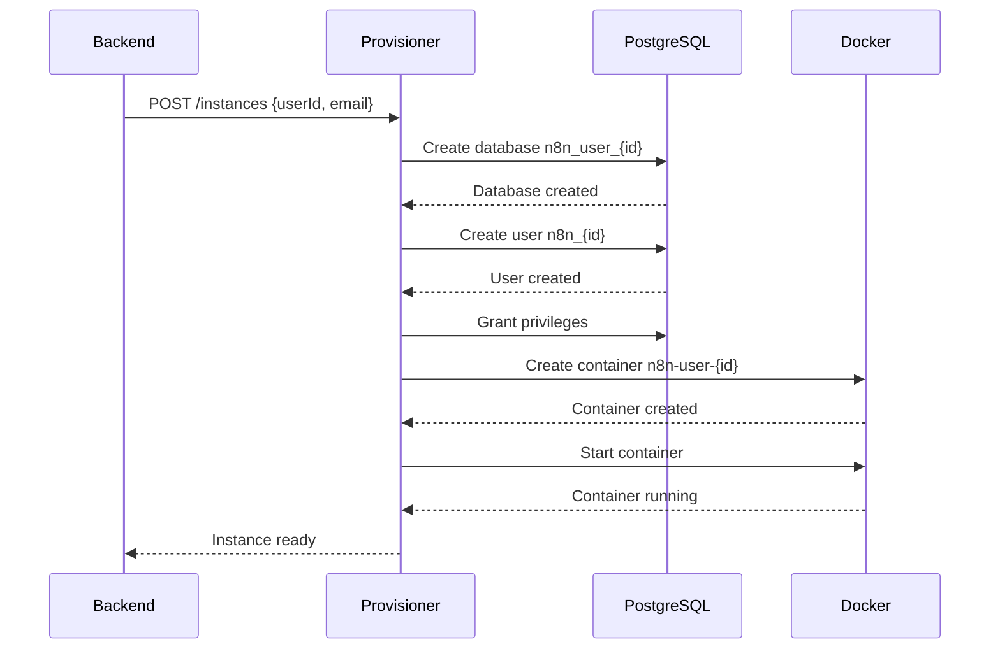
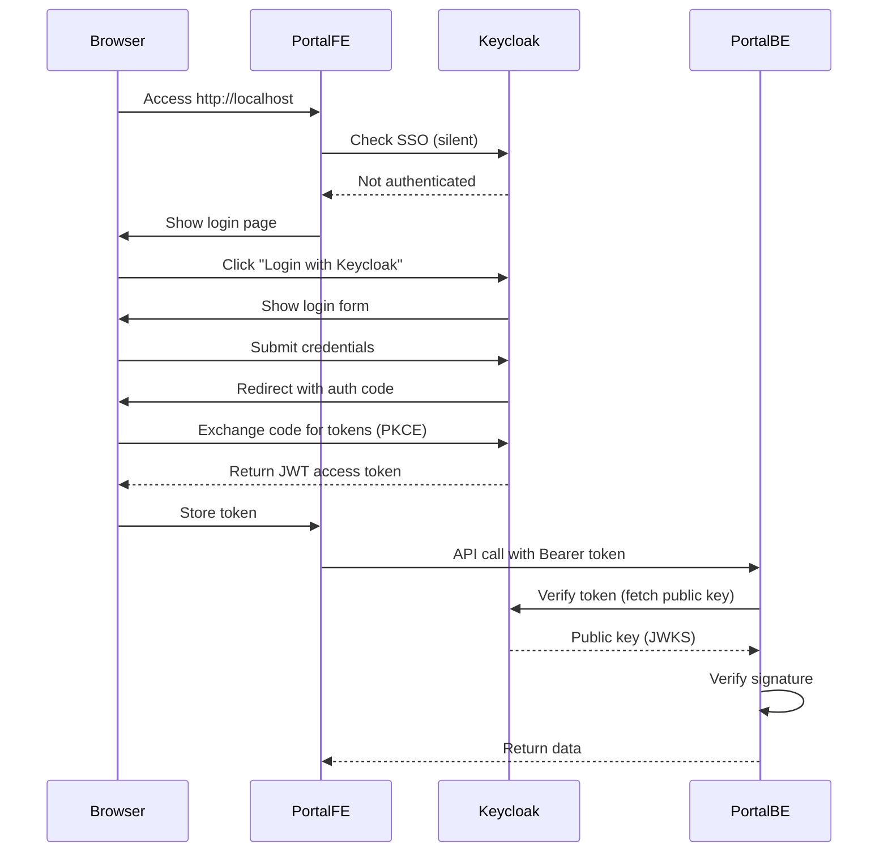
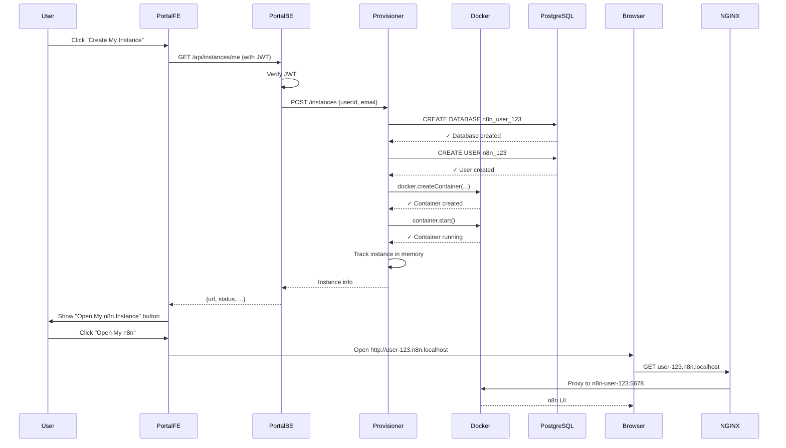
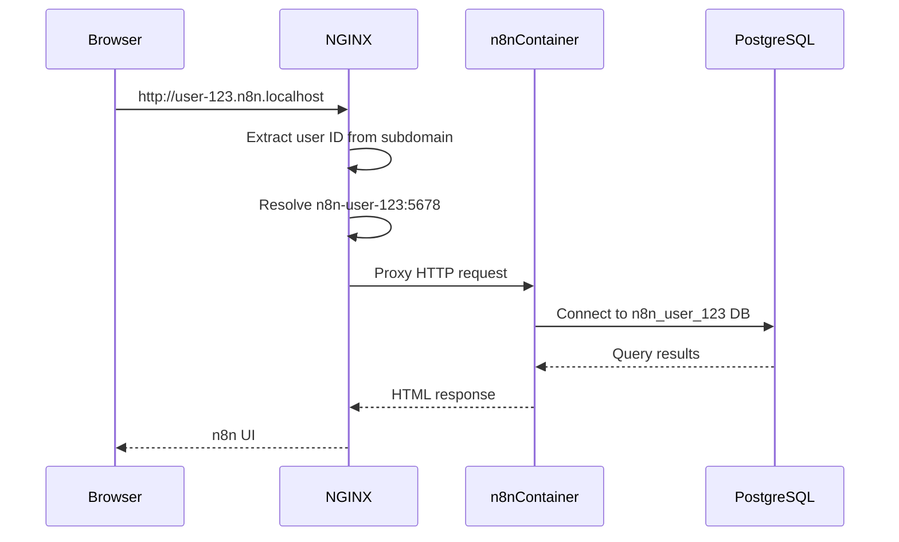
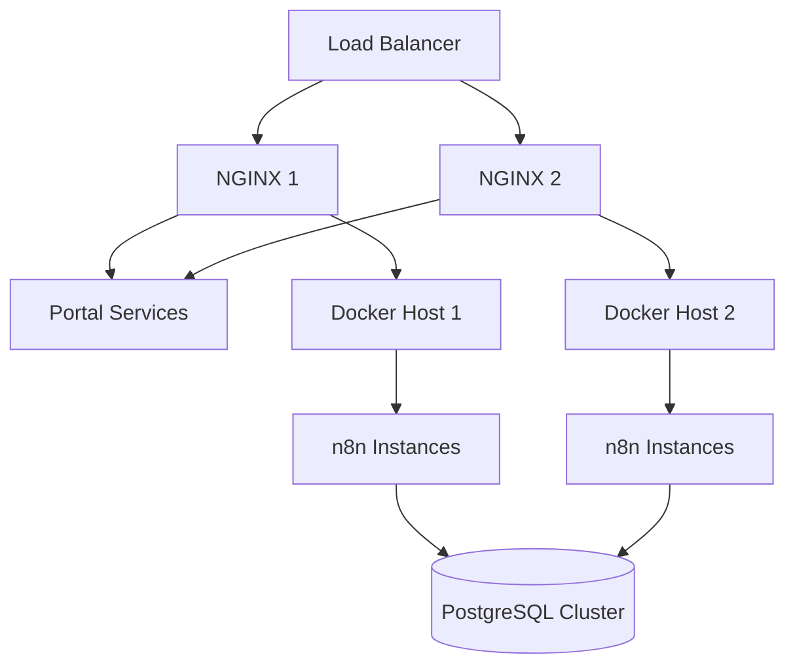

# Architecture Documentation

## Overview

This multi-tenant platform provides isolated n8n instances to authenticated users. Each user gets their own n8n container with a dedicated PostgreSQL database, ensuring complete data isolation.

## Components

### 1. Portal Frontend (React + Keycloak)

**Location**: `portal/frontend/`

**Purpose**: User interface for authentication and instance management

**Key Features**:
- Keycloak integration using `keycloak-js` library
- OAuth2/OIDC authentication flow with PKCE
- Dashboard for managing n8n instances
- Launch button to open user's n8n instance in new tab

**Technology Stack**:
- React 18
- Vite (build tool)
- Keycloak JS Adapter
- Axios (HTTP client)

**Key Files**:
- `src/keycloak.js` - Keycloak client configuration
- `src/api.js` - API client with JWT token handling
- `src/components/Dashboard.jsx` - Main dashboard
- `src/components/LoginPage.jsx` - Login interface

**Authentication Flow**:
1. User accesses portal
2. Keycloak client checks for existing session (SSO)
3. If not authenticated, shows login button
4. User clicks login → redirects to Keycloak
5. After successful login, Keycloak returns JWT token
6. Portal stores token and makes authenticated API calls

### 2. Portal Backend (Node.js + Express)

**Location**: `portal/backend/`

**Purpose**: API server that bridges frontend, Keycloak, and provisioner

**Key Features**:
- JWT token verification using Keycloak's public keys
- User instance management API
- Communication with provisioner service

**Technology Stack**:
- Node.js + Express
- jsonwebtoken + jwks-rsa (token verification)
- Axios (HTTP client)

**API Endpoints**:

```
GET  /health                 - Health check
GET  /api/user/me           - Get current user info
GET  /api/instances/me      - Get or create user's instance
GET  /api/instances/me/status - Get instance status
DELETE /api/instances/me    - Delete user's instance
GET  /api/instances         - List all instances (admin)
```

**Security**:
- All API routes protected with JWT middleware
- Tokens verified against Keycloak's public key
- User ID extracted from JWT `sub` claim

### 3. Keycloak (Identity Provider)

**Container**: `keycloak`

**Purpose**: OAuth2/OIDC identity and access management

**Configuration**:
- Realm: `n8n-platform`
- Client: `n8n-portal` (public client with PKCE)
- Database: PostgreSQL

**Features Used**:
- User registration
- Email + password authentication
- JWT token issuance
- Public key exposure for token verification
- User profile management

**Endpoints Used**:
- `/realms/{realm}/protocol/openid-connect/certs` - Public keys (JWKS)
- `/realms/{realm}/protocol/openid-connect/token` - Token endpoint
- `/realms/{realm}/protocol/openid-connect/auth` - Authorization endpoint

### 4. Provisioning Service

**Location**: `provisioner/`

**Purpose**: Dynamically create and manage n8n instances

**Key Features**:
- Docker container management via Dockerode
- PostgreSQL database provisioning
- Instance lifecycle management
- Resource limits enforcement

**Technology Stack**:
- Node.js + Express
- Dockerode (Docker API client)
- node-postgres (PostgreSQL client)

**API Endpoints**:

```
GET  /health                    - Health check
POST /instances                 - Provision new instance
GET  /instances/:userId         - Get instance info
GET  /instances                 - List all instances
DELETE /instances/:userId       - Delete instance
POST /instances/:userId/restart - Restart instance
```

**Provisioning Process**:



**Key Modules**:

#### db-manager.js
Handles PostgreSQL database operations:
- `createDatabase(userId)` - Creates dedicated database
- `deleteDatabase(userId)` - Removes database
- `databaseExists(userId)` - Checks existence

Database naming convention:
- Database: `n8n_user_{userId}` (hyphens replaced with underscores)
- User: `n8n_{first8chars}`
- Password: Random 24-character string

#### docker-manager.js
Handles Docker container operations:
- `createContainer(userId, dbCredentials, userInfo)` - Creates n8n container
- `getContainer(userId)` - Retrieves container object
- `deleteContainer(userId)` - Stops and removes container
- `listContainers()` - Lists all n8n instances

Container configuration:
- Image: `n8nio/n8n:latest` (configurable)
- Network: `n8n-platform`
- Labels: `n8n-instance=true`, `n8n-user-id={userId}`
- Environment variables: Database credentials, webhook URLs
- Resource limits: Memory and CPU limits applied

#### instance-tracker.js
In-memory state management:
- Tracks provisioned instances
- Stores metadata (user info, creation time, etc.)
- **Note**: For production, replace with Redis or database

### 5. NGINX Reverse Proxy

**Location**: `nginx/`

**Purpose**: Route traffic to appropriate services based on domain/path

**Routing Rules**:

| Request | Upstream | Purpose |
|---------|----------|---------|
| `http://localhost/` | portal-frontend:80 | Portal UI |
| `http://localhost/api/*` | portal-backend:3001 | Portal API |
| `http://user-{id}.n8n.localhost/` | n8n-user-{id}:5678 | User n8n instance |

**Key Configuration**:
- Dynamic upstream resolution for user containers
- WebSocket support for n8n
- Increased timeouts for long-running workflows
- Increased body size for file uploads (50MB)

**Subdomain Routing**:
```nginx
server_name ~^user-(?<user_id>[^.]+)\.n8n\.localhost$;
set $n8n_backend n8n-user-$user_id:5678;
proxy_pass http://$n8n_backend;
```

This captures the user ID from the subdomain and proxies to the corresponding container.

### 6. PostgreSQL Server

**Container**: `postgres`

**Purpose**: Host multiple databases for different users

**Databases**:
- `postgres` - Default database (used for management)
- `keycloak` - Keycloak's database
- `n8n_user_*` - One database per n8n instance

**Isolation Strategy**:
Each n8n instance gets:
- Dedicated database
- Dedicated user with restricted privileges
- No access to other users' databases

## Data Flow

### User Authentication Flow



### Instance Provisioning Flow



### n8n Instance Access Flow



## Security Considerations

### 1. Authentication & Authorization
- **OAuth2/OIDC**: Industry-standard authentication
- **PKCE**: Protects against authorization code interception
- **JWT Verification**: Backend validates all tokens with Keycloak's public key
- **Token Expiry**: Access tokens expire, refresh tokens handle renewal

### 2. Network Isolation
- **Docker Network**: All containers on isolated bridge network
- **No Direct Access**: n8n instances not exposed directly to host
- **Reverse Proxy**: Single entry point via NGINX

### 3. Database Isolation
- **Separate Databases**: Each user has dedicated database
- **Limited Privileges**: Database users can only access their own database
- **Strong Passwords**: 24-character random passwords for database users

### 4. Resource Limits
- **Memory Limits**: Default 512MB per container (configurable)
- **CPU Limits**: Default 1 CPU core per container (configurable)
- **Prevents Resource Exhaustion**: One user can't consume all resources

### 5. Container Security
- **Non-root User**: n8n runs as non-root inside container
- **Read-only Filesystem**: Where possible (not implemented yet)
- **No Privileged Mode**: Containers run without elevated privileges

## Scalability Considerations

### Current Limitations

1. **Single Host**: All containers run on one Docker host
2. **In-Memory State**: Instance tracking stored in memory (lost on restart)
3. **No Auto-Scaling**: Manual capacity management
4. **No Load Balancing**: Single NGINX instance

### Scaling Strategies

#### Horizontal Scaling (Multiple Hosts)



**Requirements**:
- External load balancer (HAProxy, AWS ALB, etc.)
- Shared database (managed PostgreSQL service)
- Container orchestration (Kubernetes, Docker Swarm)
- Distributed state management (Redis, etcd)

#### Kubernetes Migration

For production scale, migrate to Kubernetes:

```yaml
# Simplified K8s architecture
- Ingress Controller (routes to user pods)
- Portal Deployment (frontend + backend)
- Provisioner Deployment (creates pods dynamically)
- PostgreSQL StatefulSet (or managed service)
- Keycloak Deployment
```

Benefits:
- Auto-scaling
- Self-healing
- Rolling updates
- Resource quotas
- Better monitoring

#### Resource Optimization

**Instance Sleeping**:
- Stop idle instances after X hours
- Resume on demand (cold start)
- Reduces resource usage

**Shared Database**:
- Use PostgreSQL schemas instead of separate databases
- Reduces database count
- Still provides logical isolation

**Multi-Tenancy Levels**:
- **L1**: Separate container + database (current)
- **L2**: Shared container, separate database
- **L3**: Shared container + database with tenant ID

## Monitoring & Observability

### Recommended Additions

1. **Prometheus + Grafana**
   - Container metrics (CPU, memory, network)
   - n8n workflow metrics
   - Database metrics

2. **Logging**
   - Centralized logging (ELK, Loki)
   - Structured logs with correlation IDs
   - Log aggregation across containers

3. **Alerting**
   - Instance failures
   - Resource exhaustion
   - Database connection issues

4. **Tracing**
   - Distributed tracing (Jaeger, Zipkin)
   - Track requests across services

## Disaster Recovery

### Backup Strategy

1. **Database Backups**
   ```bash
   # Backup all user databases
   docker exec postgres pg_dumpall -U postgres > backup.sql
   ```

2. **Container Persistence**
   - Use Docker volumes for n8n data directories
   - Regular volume snapshots

3. **Configuration Backup**
   - Store Keycloak realm export
   - Store instance metadata

### Recovery Process

1. Restore PostgreSQL databases
2. Restore Keycloak configuration
3. Recreate containers using instance metadata
4. Update NGINX routing

## Future Enhancements

1. **User Quotas**
   - Limit workflows per user
   - Limit executions per month
   - Limit storage

2. **Billing Integration**
   - Usage tracking
   - Subscription management
   - Payment processing

3. **Advanced Features**
   - Instance templates
   - Team/organization support
   - Shared workflows marketplace

4. **Monitoring Dashboard**
   - Admin panel
   - Instance health view
   - Resource usage graphs

5. **CI/CD Integration**
   - n8n workflow version control
   - Automated testing
   - Deployment pipelines

## Troubleshooting

### Common Issues

**Issue**: Container fails to start
- **Check**: Database credentials are correct
- **Check**: PostgreSQL is reachable from container
- **Check**: Docker network exists
- **Logs**: `docker logs n8n-user-{id}`

**Issue**: Can't access n8n instance
- **Check**: Container is running (`docker ps`)
- **Check**: `/etc/hosts` has correct entry
- **Check**: NGINX can resolve container name
- **Logs**: `docker logs n8n-nginx`

**Issue**: Database connection failed
- **Check**: PostgreSQL is running
- **Check**: Database was created successfully
- **Check**: User has correct privileges
- **Command**: `docker exec postgres psql -U postgres -l`

## Performance Tuning

### Database
```sql
-- Increase connections
ALTER SYSTEM SET max_connections = 200;

-- Tune memory
ALTER SYSTEM SET shared_buffers = '256MB';
ALTER SYSTEM SET effective_cache_size = '1GB';
```

### n8n Containers
```yaml
# Increase resources for power users
environment:
  - N8N_PAYLOAD_SIZE_MAX=16
  - EXECUTIONS_DATA_MAX_AGE=168  # 7 days
```

### NGINX
```nginx
worker_processes auto;
worker_connections 4096;

# Enable caching
proxy_cache_path /var/cache/nginx levels=1:2 keys_zone=cache:10m;
```

## Conclusion

This architecture provides a solid foundation for a multi-tenant n8n platform. While suitable for development and small-scale production, consider migrating to Kubernetes and adding external services (managed database, Redis, monitoring) for large-scale deployments.
