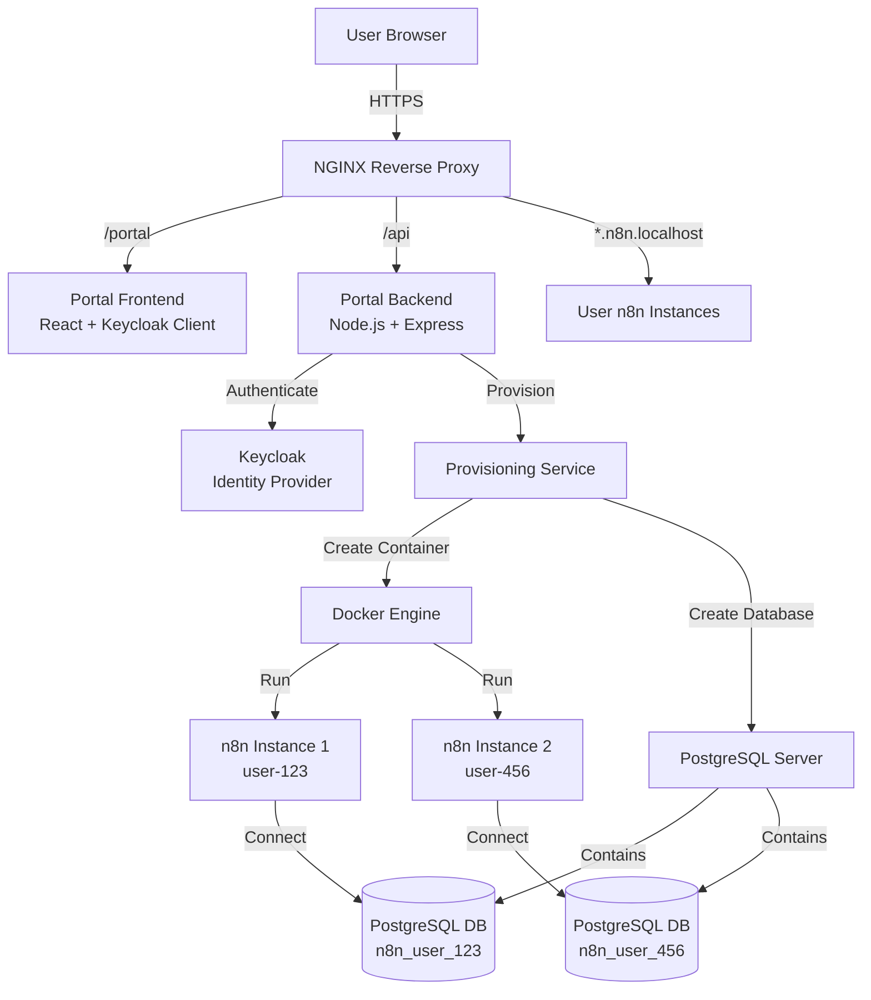
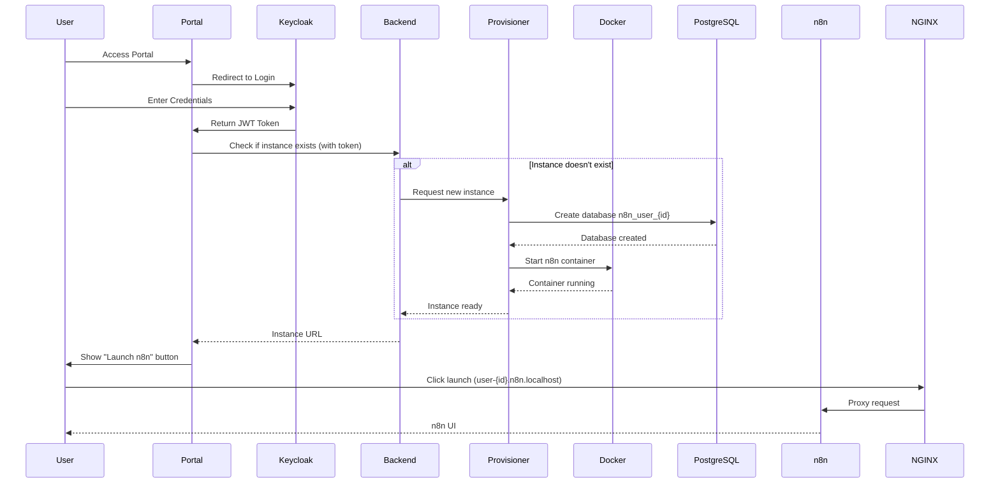

# Multi-Tenant n8n Platform with Keycloak Authentication

This is a multi-tenant platform that wraps n8n instances with Keycloak authentication. Each authenticated user gets their own isolated n8n instance with a dedicated PostgreSQL database.

## Architecture Overview



## Components

### 1. User Portal
- **Frontend**: React application with Keycloak integration
- **Backend**: Express.js API server
- **Purpose**: User authentication, instance management, and launch interface

### 2. Keycloak
- **Purpose**: Identity and access management (IAM)
- **Features**: OAuth2/OIDC authentication, user management, SSO

### 3. Provisioning Service
- **Purpose**: Dynamically provision n8n instances
- **Functions**:
  - Create PostgreSQL databases
  - Spin up Docker containers
  - Configure instance settings
  - Manage instance lifecycle

### 4. NGINX Reverse Proxy
- **Purpose**: Route traffic to appropriate services
- **Routes**:
  - `/portal/*` → Portal frontend
  - `/api/*` → Portal backend
  - `user-{id}.n8n.localhost` → User's n8n instance

### 5. PostgreSQL Server
- **Purpose**: Host separate databases for each n8n instance
- **Isolation**: One database per user

## Flow Diagram



## Directory Structure

```
multi-tenant-platform/
├── README.md                    # This file
├── ARCHITECTURE.md              # Detailed architecture documentation
├── docker-compose.yml           # Main orchestration file
├── .env.example                 # Environment variables template
├── portal/                      # User portal application
│   ├── backend/                 # Express.js backend
│   │   ├── src/
│   │   │   ├── index.js        # Entry point
│   │   │   ├── config.js       # Configuration
│   │   │   ├── routes/         # API routes
│   │   │   ├── middleware/     # Auth middleware
│   │   │   └── services/       # Business logic
│   │   ├── package.json
│   │   └── Dockerfile
│   └── frontend/                # React frontend
│       ├── src/
│       │   ├── App.jsx
│       │   ├── keycloak.js     # Keycloak configuration
│       │   ├── components/
│       │   └── pages/
│       ├── package.json
│       ├── vite.config.js
│       └── Dockerfile
├── provisioner/                 # n8n provisioning service
│   ├── src/
│   │   ├── index.js            # Entry point
│   │   ├── docker-manager.js   # Docker container management
│   │   ├── db-manager.js       # Database provisioning
│   │   └── instance-tracker.js # Track instance state
│   ├── package.json
│   └── Dockerfile
├── nginx/                       # Reverse proxy configuration
│   ├── nginx.conf
│   └── Dockerfile
└── scripts/                     # Utility scripts
    ├── setup.sh                 # Initial setup
    ├── cleanup.sh               # Clean up instances
    └── init-keycloak.sh         # Configure Keycloak realm
```

## Prerequisites

- Docker and Docker Compose installed
- Node.js 18+ (for local development)
- At least 4GB RAM available
- Ports available: 80, 8080, 5432, 8081

## Quick Start

### 1. Clone and Setup

```bash
cd multi-tenant-platform
cp .env.example .env
# Edit .env with your configuration
```

### 2. Start Services

```bash
docker-compose up -d
```

This will start:
- Keycloak (http://localhost:8080)
- PostgreSQL
- Portal Backend (http://localhost:3001)
- Portal Frontend (http://localhost:3000)
- Provisioning Service
- NGINX (http://localhost)

### 3. Configure Keycloak

```bash
./scripts/init-keycloak.sh
```

This script will:
- Create a realm named `n8n-platform`
- Create a client for the portal
- Set up redirect URIs

### 4. Access the Platform

1. Open http://localhost
2. Click "Login with Keycloak"
3. Create an account or login
4. Click "Launch My n8n Instance"
5. Your personal n8n instance will be provisioned at `http://user-{your-id}.n8n.localhost`

## Configuration

### Environment Variables

Key environment variables in `.env`:

```env
# Keycloak
KEYCLOAK_URL=http://keycloak:8080
KEYCLOAK_REALM=n8n-platform
KEYCLOAK_CLIENT_ID=n8n-portal
KEYCLOAK_CLIENT_SECRET=<generated-secret>

# PostgreSQL
POSTGRES_HOST=postgres
POSTGRES_PORT=5432
POSTGRES_USER=postgres
POSTGRES_PASSWORD=<secure-password>

# Portal
PORTAL_BACKEND_PORT=3001
PORTAL_FRONTEND_PORT=3000

# n8n Configuration
N8N_BASE_DOMAIN=n8n.localhost
N8N_IMAGE=n8nio/n8n:latest
```

## Development

### Running Locally

```bash
# Start infrastructure only (Keycloak, PostgreSQL)
docker-compose up -d keycloak postgres

# Run portal backend
cd portal/backend
npm install
npm run dev

# Run portal frontend (in another terminal)
cd portal/frontend
npm install
npm run dev

# Run provisioner (in another terminal)
cd provisioner
npm install
npm run dev
```

## Security Considerations

1. **Database Isolation**: Each user has a completely separate PostgreSQL database
2. **Network Isolation**: n8n instances run in isolated Docker containers
3. **Authentication**: All access is protected by Keycloak OAuth2/OIDC
4. **JWT Validation**: Backend validates all tokens with Keycloak
5. **Resource Limits**: Each n8n container has memory and CPU limits

## Scaling Considerations

For production deployment, consider:

1. **Move to Kubernetes**: Better orchestration for many instances
2. **Add Resource Quotas**: Limit CPU/memory per user
3. **Implement Auto-Shutdown**: Stop idle instances to save resources
4. **Add Load Balancer**: Distribute traffic across multiple hosts
5. **External PostgreSQL**: Use managed database service
6. **Persistent Storage**: Use volume drivers for data persistence
7. **Monitoring**: Add Prometheus/Grafana for observability

## Troubleshooting

### Check Service Status

```bash
docker-compose ps
```

### View Logs

```bash
# All services
docker-compose logs -f

# Specific service
docker-compose logs -f portal-backend
docker-compose logs -f provisioner
```

### Check User Instances

```bash
docker ps --filter "label=n8n-instance=true"
```

### Access PostgreSQL

```bash
docker-compose exec postgres psql -U postgres
\l  # List databases
```

## Cleanup

### Stop All Services

```bash
docker-compose down
```

### Remove All Data

```bash
docker-compose down -v  # Removes volumes too
./scripts/cleanup.sh     # Removes user instances
```

## License

This multi-tenant platform wrapper is provided as-is. n8n itself is licensed under the Sustainable Use License.

## Support

For issues with:
- **This platform**: Check the logs and troubleshooting section
- **n8n itself**: See https://docs.n8n.io
- **Keycloak**: See https://www.keycloak.org/documentation
